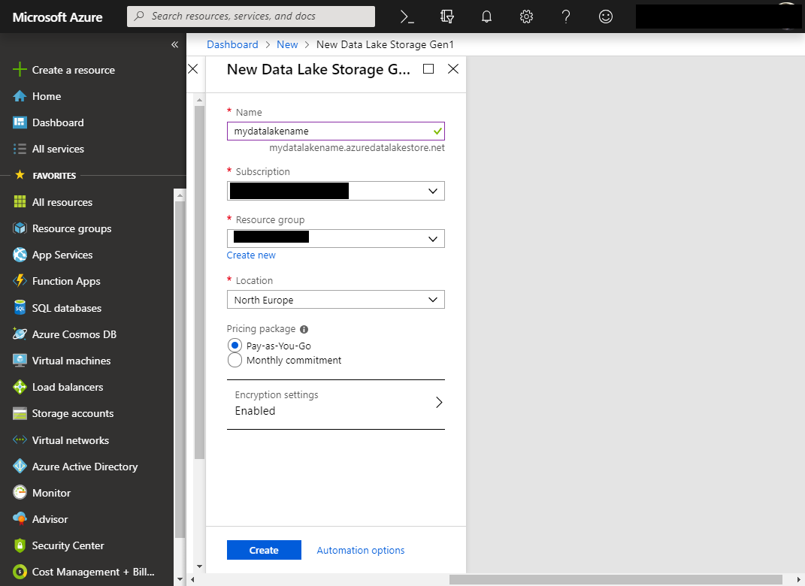

# Getting Started

# MATLAB Interface *for Azure Data Lake Storage*

This MATLAB® interface connects to the Azure™ Data Lake™ Storage service, allowing users to persist MATLAB and Simulink® artifacts to the Azure Cloud via the Azure Data Lake Storage service. Azure Data Lake Storage is designed to be an enterprise-wide, hyper-scale repository for big data analysis workloads.

When getting started with Azure Data Lake Store the first steps are to:
* Configure Azure Active Directory
* Configure Azure Data Lake Storage
* Configure the MATLAB interface

## Configure Azure Active Directory and Data Lake Store
In most cases an existing Active Directory will be used, if one is not available it will need to be created. If creating an Active Directory, consulting the organization's IT team is strongly advised. To create an Azure Data Lake Storage Gen1<sup>1</sup>:



Note the full Fully Qualified Domain Name (FQDN) for the created Data Lake store. In this case, *mydatalakename.azuredatalakestore.net*. It will be required in later steps.   

Ensure that if the Data Lake Storage Firewall is enabled, the settings permit access to the IP from which the client is being used.

Active Directory authentication is required to permit MATLAB to access the data. There are two authentication methods; Service-to-service and End-user. For more information see:
* <https://docs.microsoft.com/en-us/azure/data-lake-store/data-lake-store-service-to-service-authenticate-using-active-directory>   
* <https://docs.microsoft.com/en-us/azure/data-lake-store/data-lake-store-end-user-authenticate-using-active-directory>

### Service-to-service authentication using Azure Active Directory
1. Create an end-user web app / API application by registering MATLAB as a web app / API application on the Azure Portal. In some Azure environments this step may require the involvement of the IT team as it requires specific rights in Azure which may be restricted<sup>1</sup>.    
    
2. Note the Application ID for later<sup>1</sup>.    
    
3. Select Settings and Keys to create a key for the application and note the key for use with MATLAB. Note, that this key will be presented only during creation time and will no longer be accessible after creation (the key shown key is no longer in use)<sup>1</sup>.    
    
4. Assign the application to the Data Lake Store account file or folder in the Azure portal. Open the Data Lake account that is to be associated with the application registration. Select the Data Lake Store and then select Data Explorer. Add Custom Access permissions and in the Select User or Group blade select the application registration created earlier and add it. Click Select Permissions, select the permissions and whether to assign the permissions as a default ACL, access ACL, or both. Click OK. If planning on restricting the Azure Active Directory application to a specific folder, then give it same Azure Active directory application Execute permission to the root to enable file creation access. If *403* access errors are received when trying to access data it may be caused by a problem with this step<sup>1</sup>.    
    
5. Get the OAuth 2.0 Token Endpoint. Select Active Directory, App Registrations.From the top of the App Registrations blade, click Endpoints. Select the OAuth 2.0 Token Endpoint and note its value.
6. The MATLAB client requires 4 pieces of data from the configuration steps above. These can be stored in a JSON file or the client can be manually configured via MATLAB script. It is advised to securely store the credentials in the JSON configuration file rather than in scripts which are likely to be shared and stored in accessible revision control systems. If storing the credentials in the JSON file, by default it is named *azuredatalakestore.json*. A template file can be found in: *azure/Software/MATLAB/SDK/config/azuredatalake.json.template.servicetoservice*.
```
{
    "ClientId": "1d[REDACTED]1c",
    "AuthTokenEndpoint": "https://login.microsoftonline.com/2eb[REDACTED]eb2/oauth2/token",
    "ClientKey": "mK[REDACTED]4=",
    "AccountFQDN": "mydatalakename.azuredatalakestore.net"
}
```
7. Now create and initialize the Data Lake client. Run the *startup.m* file in the */Azure-Data-Lake-Storage/Software/MATLAB* directory, this configures required paths in advance of using the client. Then declare and initialize a client as follows:
```
startup
Adding Interface for Azure Data Lake Storage Paths
Adding /home/username/mydir/Azure-Data-Lake-Storage/Software/MATLAB/app
Adding /home/username/mydir/Azure-Data-Lake-Storage/Software/MATLAB/app/functions
Adding /home/username/mydir/Azure-Data-Lake-Storage/Software/MATLAB/app/system
Adding /home/username/mydir/Azure-Data-Lake-Storage/Software/MATLAB/lib
Adding /home/username/mydir/Azure-Data-Lake-Storage/Software/MATLAB/config
Running post setup operations
Adding: /home/username/mydir/Azure-Data-Lake-Storage/Software/MATLAB/lib/jar/target/azure-dl-sdk-0.1.0.jar
%
dlClient = azure.datalake.store.ADLStoreClient;
dlClient.initialize();
% Check the Client properties to confirm they have been set in the Client
dlClient
dlClient =
  ADLStoreClient with properties:
  ClientId: '1d[REDACTED]1c'
  AuthTokenEndpoint: 'https://login.microsoftonline.com/2eb[REDACTED]eb2/oauth2/token'
  ClientKey: 'mK[REDACTED]4='
  AccountFQDN: 'mydatalakename.azuredatalakestore.net'
```

This client can now be used to carryout Data Lake operations.


### End-user authentication

1. Create a end-user native application by registering MATLAB as a native application on the Azure Portal. In some Azure environments this step may require the involvement of the IT team as it requires specific rights in Azure which may be restricted<sup>1</sup>.    
    
2. Note the Application ID and Redirect URI for later<sup>1</sup>.    
    
3. In Settings / API Access / Required Permissions add API access to Azure Data Lake from the API selection<sup>1</sup>.    
    
And enable access permissions to the Native App<sup>1</sup>.    
    
3. Also add access for the Windows Azure Service Management API via the same process.
4. The MATLAB client requires 2 pieces of data from the configuration steps above. For convenience it is best to store the configuration details in a file that is read when the client is initialized. The client can be manually configured via MATLAB script. It is advised to securely store the credentials in the JSON file rather than in scripts which are likely to be shared and stored in accessible revision control systems. A template file is provided, *Azure-Data-Lake-Storage/Software/MATLAB/SDK/config/azuredatalake.json.template.enduser*, with the following contents:
```
{
    "AccountFQDN" = "mydatalakename.azuredatalakestore.net",
    "NativeAppId" = "1d184e4a-62c0-4244-8b68-4cffe757131c"
}
```
Rename this file to *azuredatalake.json* and amend the values with FQDN and Application Id values obtained in the previous steps. The [Basic Usage](BasicUsageADL.md) guide provides more detail on working with configuration files and parameters.
6. Now create and initialize the Data Lake client. Run the *startup.m* file in the */Azure-Data-Lake-Storage/Software/MATLAB* directory, this configures required paths in advance of using the client. Then declare and initailize a client as follows. This will prompt the user to open URL <https://microsoft.com/devicelogin> in a broswer and enter the provided code prior to authenticating with end-user Azure credentials as for other Active Directory services<sup>1</sup>.    

```
startup
Adding Interface for Azure Data Lake Storage Paths
Adding /home/username/mydir/Azure-Data-Lake-Storage/Software/MATLAB/app
Adding /home/username/mydir/Azure-Data-Lake-Storage/Software/MATLAB/app/functions
Adding /home/username/mydir/Azure-Data-Lake-Storage/Software/MATLAB/app/system
Adding /home/username/mydir/Azure-Data-Lake-Storage/Software/MATLAB/lib
Adding /home/username/mydir/Azure-Data-Lake-Storage/Software/MATLAB/config
Running post setup operations
Adding: /home/username/mydir/Azure-Data-Lake-Storage/Software/MATLAB/lib/jar/target/azure-dl-sdk-0.1.0.jar
%
dlClient = azure.datalake.store.ADLStoreClient;
dlClient.initialize;
  To sign in, use a web browser to open the page https://microsoft.com/devicelogin and enter the code DYE69A87C to authenticate.
```
Once authenticated the client can be used to carryout Data Lake operations.

## Miscellaneous

### Logging - enabling verbose feedback
See [Logging](Logging.md) for details of enabling verbose output during development and testing.

### Using a non-default configuration file
Using a non-default name for the configuration file is useful if there are more than one set of credentials in use, e.g. one for test and one for production environments. To use an alternate file name, set the client *ConfigFile* to the desired value as follows, after creating the client but before initializing it.
```
dlClient = azure.datalake.store.ADLStoreClient;
dlClient.ConfigFile = '/home/username/myconfigfile.json'
dlClient.initialize;
```

## Notes    

* <sup>1</sup>Used with permission from Microsoft.    

----------------
[//]: #  (Copyright 2017 The MathWorks, Inc.)
